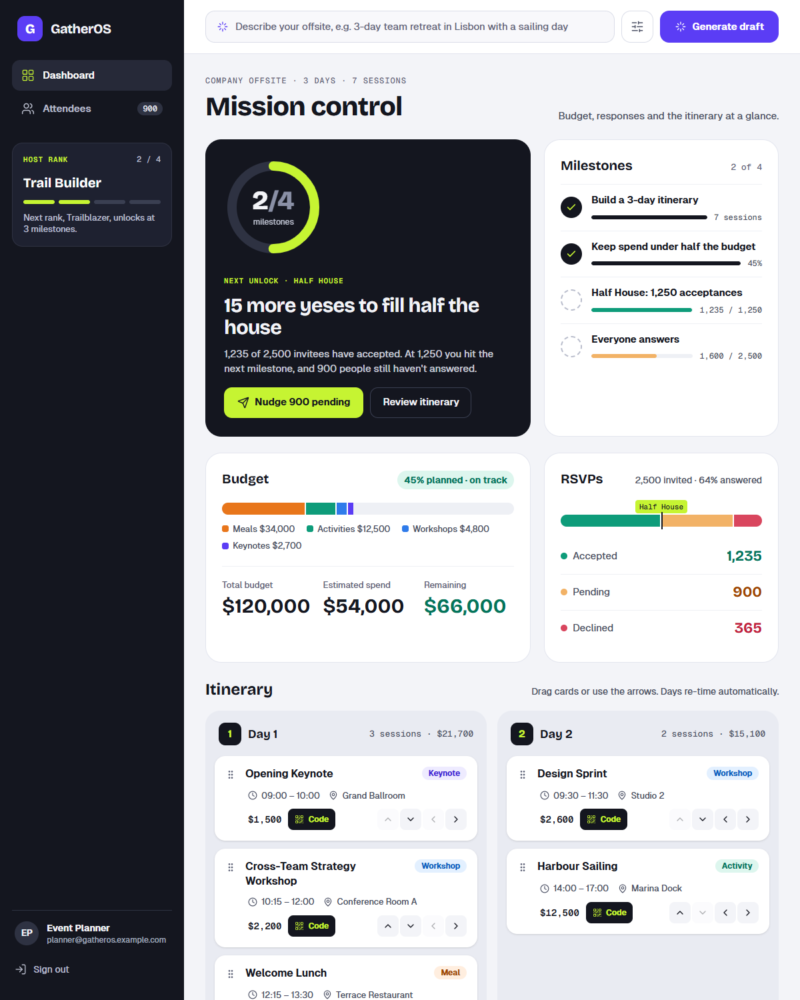
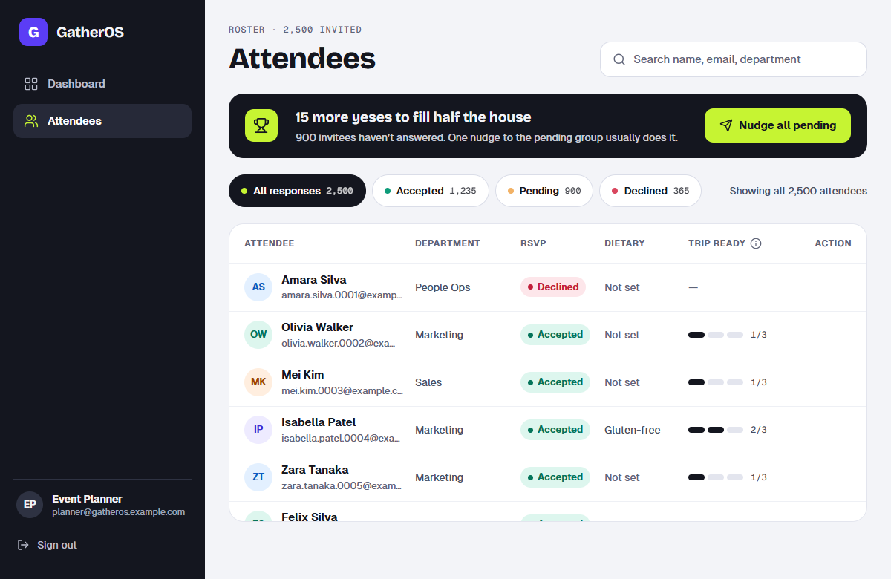
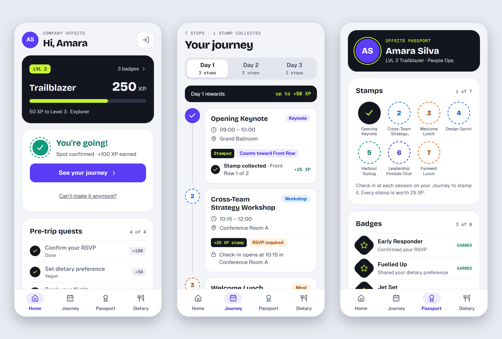
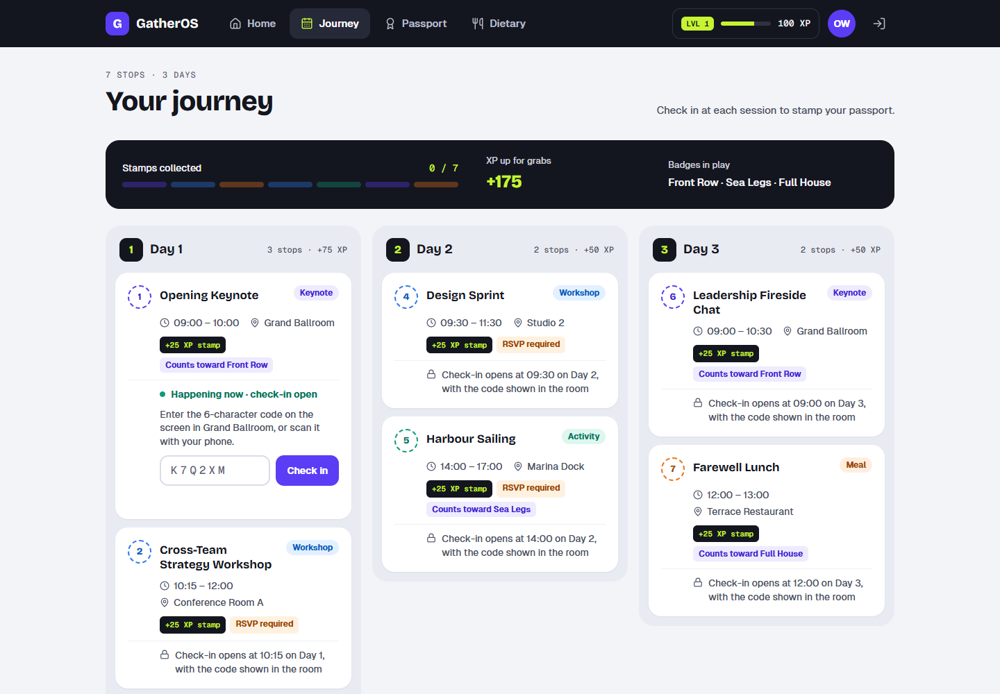
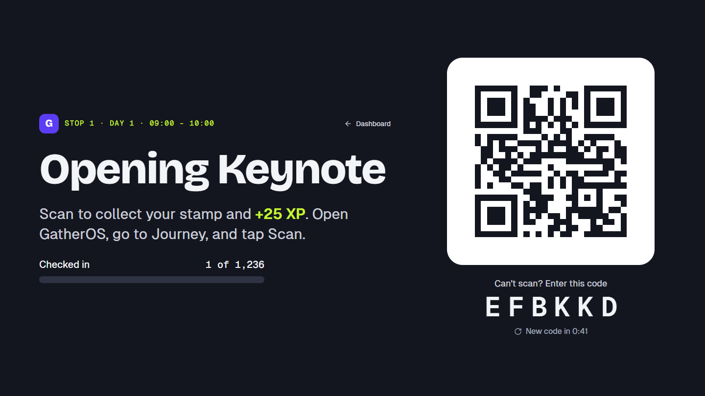
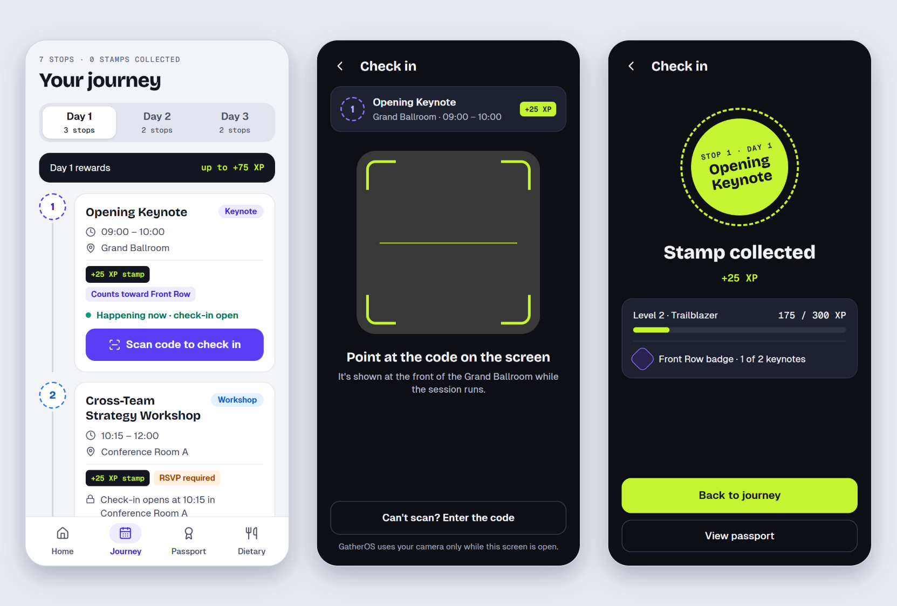
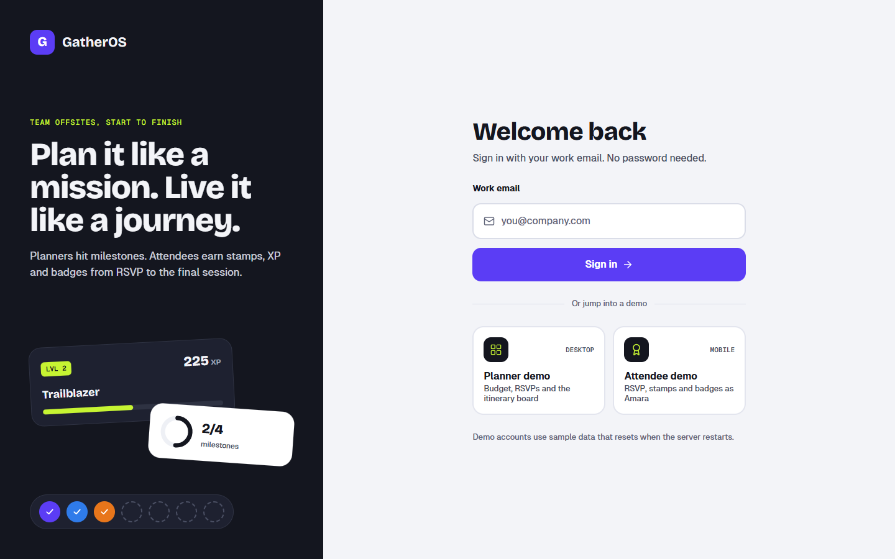
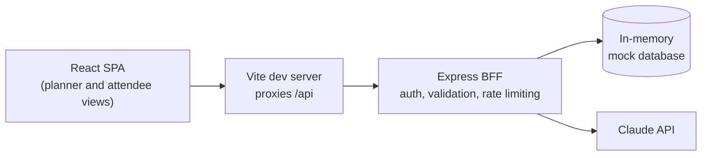

# GatherOS

[](https://github.com/samssj10/GatherOS/actions/workflows/ci.yml)

**A multi-sided corporate offsite platform, designed as a game.** Planners run their offsite from a "mission control" dashboard: milestones, a host rank, a budget breakdown and an AI-drafted, drag-and-drop itinerary. Attendees get a companion, mobile-first with a full desktop layout, where RSVPing, picking a meal and checking in at sessions earns XP, stamps and badges. Both personas run from one React app on a Node.js backend-for-frontend (BFF), with itineraries drafted by Claude.

<p align="center">
  
  <br>
  <sub><b>Mission control:</b> milestones, budget by category, RSVPs and the drag-and-drop itinerary</sub>
</p>

<p align="center">
  
  <br>
  <sub><b>Roster:</b> 2,500 attendees, filterable, with a "Trip ready" meter and one-click nudges</sub>
</p>

<p align="center">
  
  <br>
  <sub><b>Attendee app on a phone:</b> level and quests, the journey with check-in stamps, and the passport</sub>
</p>

<p align="center">
  
  <br>
  <sub><b>Attendee site on desktop:</b> a top bar with your level, a stamp progress strip and one column per day; the live session takes the room code</sub>
</p>

<p align="center">
  
  <br>
  <sub><b>Room check-in code:</b> project it at the front of the room; the code changes every minute</sub>
</p>

<p align="center">
  
  <br>
  <sub><b>Checking in on a phone:</b> a live session, scan the room's QR code, stamp collected</sub>
</p>

<p align="center">
  
  <br>
  <sub><b>Sign-in:</b> passwordless, with one-click demo accounts for both personas</sub>
</p>

## Features

### For planners (desktop)

- **Mission control.** A readiness hero tells you the one thing to do next ("14 more yeses to fill half the house"), backed by four milestones: plan all three days, keep spend under half the budget, reach Half House (half the invitees accepted) and get everyone to answer. Completing them raises your **host rank**, shown in the sidebar.
- **AI itinerary drafts.** Describe the offsite, optionally set the city, days and attendee count, and Claude returns a structured itinerary. It lands on the board as an *unsaved draft*; milestones, rank and budget recalculate for it until you save or discard it.
- **Drag-and-drop itinerary.** Reorder sessions within a day or drop them onto another day, by mouse or keyboard. Every card also has up, down, previous-day and next-day buttons. After any move the affected day is re-timed automatically so sessions run back to back, 15 minutes apart, each keeping its own duration.
- **Room check-in code.** Every saved session card has a **Code** button that opens a full-screen display for the room: a QR code, a six-character code under it, a countdown to the next code and a live "checked in n of N" bar. The code changes every minute and only works while the session is live.
- **Budget breakdown.** A stacked bar by category (meals, activities, workshops, keynotes) with an "on track", "close to the limit" or "over budget" status.
- **RSVP overview.** Accepted, pending and declined totals with a Half House marker.
- **Virtualized roster.** All 2,500 attendees, searchable and filterable by response, with only about 20 rows in the DOM at any time. A **Trip ready** meter shows who has answered, accepted and booked a flight, and **Nudge** reminds pending attendees one at a time or all at once.

### For attendees (phone and desktop)

- **Home.** Level, rank and XP at a glance. The RSVP is a quest ("Are you in?") with an optimistic UI that responds instantly and rolls back on failure. A pre-trip checklist and a "first stop" teaser follow. On desktop the page becomes two columns with a "Day 1 at a glance" card.
- **Journey.** On a phone: day tabs and a stop-by-stop timeline. On desktop: a stamp progress strip and one column per day. Check-in opens when a session starts and closes when it ends. While one is live, **scan the QR code** on the room screen with your phone's camera, or **type the six-character code** (on desktop, or when the camera is unavailable), to collect its stamp and XP.
- **Passport.** Your stamps, six badges (Early Responder, Fuelled Up, Jet Set, Front Row, Sea Legs, Full House) and a **team race** showing the share of each department that is going. On desktop it opens with a hero of XP, stamps and badges.
- **Dietary quest.** Four large options, saved instantly, with a "Meals on this trip" list.
- Touch targets of at least 44px. A four-tab bottom navigation on phones and a top navigation bar, with your level and XP, on desktop.

### Platform

- Role-based access: planners and attendees see different routes and have different API permissions.
- Accessibility audited with axe-core: 0 violations across every screen, including the richer states (drafts, stamps, nudges). Skip link, live regions, per-page titles and keyboard alternatives for every drag.
- Unit tests for the business rules, plus a Playwright end-to-end journey with network interception, all run in CI on every push.

## How the game works

All of this is derived from real data; nothing is hard-coded to the demo.

| Action | XP |
| --- | --- |
| Accept your RSVP | 100 |
| Set your dietary preference (any option counts, including "no restrictions") | 50 |
| Flight booked by the travel team | 75 |
| Each session you check in to | 25 |

Levels: Newcomer (0 XP), Trailblazer (150), Explorer (300), Legend (450). Badges are earned from those actions; Front Row, Sea Legs and Full House mean stamping every keynote, every activity and every session, so they adapt to whatever itinerary exists. Only attendees who are going can collect stamps.

Planner ranks follow completed milestones: Scout (0), Pathfinder (1), Trail Builder (2), Trailblazer (3), Summit Host (4).

## Tech stack

| Layer | Technology |
| --- | --- |
| Client | React 19, Vite, TypeScript (strict), Tailwind CSS v4 with design tokens, React Router, Lucide icons |
| Typography | Bricolage Grotesque (headings), Geist (text) and Geist Mono (labels), self-hosted through Fontsource |
| Server state | TanStack Query v5 |
| Client UI state | Zustand (ephemeral UI state only: toasts and roster filters) |
| Performance and interaction | `@tanstack/react-virtual`, `@dnd-kit` |
| BFF | Node.js, Express 5, TypeScript, zod, helmet, pino, express-rate-limit |
| AI | Anthropic Claude via the official SDK, using structured JSON output |
| Quality | Vitest, Playwright, ESLint, Husky and lint-staged, GitHub Actions |

## Architecture



**Server.** Requests flow `route -> controller -> service`. Controllers only translate HTTP; business logic and every external call live in `services/`. All request bodies, query strings and params are validated with zod. A single `AppError` class and a global error handler return consistent JSON errors and never leak stack traces. Logs are structured (pino) with PII fields such as email and name redacted, and token usage is logged for each AI call.

**Client.** There is a strict boundary between two kinds of state. Anything fetched from the BFF lives in TanStack Query and is never copied elsewhere. Zustand holds only UI state that has no server counterpart. Pages and layouts are route-split with `React.lazy`. Colors, fonts and radii are design tokens defined once in `index.css` and used by name (`bg-ink`, `text-brand-ink`, `font-display`).

### Design decisions worth knowing

- **Game rules are pure functions.** XP, levels, quests, badges, milestones and host ranks live in `client/src/utils/` as plain, tested functions over data the app already fetches. There is no separate "progress" service to keep in sync.
- **Optimistic updates with rollback.** RSVP, dietary and itinerary moves update the cache immediately, restore the previous value on error, and confirm with a toast only after the server answers. Check-in is the exception: the server decides (room code, session clock, RSVP), so the stamp appears once it says yes.
- **Re-timing is deterministic and shared.** The rule lives in one small pure function, `reflowDay`, on the server and mirrored on the client. The client copy makes the board update instantly; the server's answer then replaces it, so the two cannot silently drift apart. Both copies are unit tested.
- **AI drafts live in a cache-only query.** The unsaved draft is stored under a TanStack Query key with `skipToken`, so it is never refetched. A window refocus cannot overwrite it with the saved itinerary, and moving cards inside a draft is purely local until the planner clicks *Save*.
- **Model output is not trusted.** Even with structured outputs, Claude's response is re-validated with the same zod schema used by the save endpoint, and its IDs are replaced with unique ones.
- **Sessions are signed cookies.** The session is an HMAC-signed token in an `HttpOnly`, `SameSite=Strict` cookie (`Secure` in production), verified with a constant-time comparison.

## Getting started

### Prerequisites

- Node.js 22 or newer and npm
- An [Anthropic API key](https://console.anthropic.com/) (optional, only needed for AI generation)

### Install

```bash
git clone https://github.com/samssj10/GatherOS.git
cd GatherOS

npm install
npm install --prefix client
npm install --prefix server
```

### Configure

```bash
cp server/.env.example server/.env
cp client/.env.example client/.env
```

On Windows PowerShell, use `Copy-Item` instead of `cp`.

Then edit `server/.env`:

1. Set `SESSION_SECRET` to a long random value. You can generate one with:
   ```bash
   node -e "console.log(require('crypto').randomBytes(32).toString('hex'))"
   ```
2. To enable AI generation, set `ANTHROPIC_API_KEY`. Everything else works without it, and the generate endpoint simply answers `503` until a key is set.

### Run

```bash
npm run dev
```

This starts the BFF on <http://localhost:3000> and the client on <http://localhost:5173>. Open the client and sign in with one of the demo accounts.

### Demo accounts

Sign-in is passwordless and uses mock data, so only the email is needed. The sign-in page has shortcut cards for both.

| Role | Email |
| --- | --- |
| Planner | `planner@gatheros.example.com` |
| Attendee | `amara.silva.0001@example.com` |

Any seeded attendee works. Emails follow the pattern `first.last.NNNN@example.com`, numbered 0001 to 2500.

## Configuration

### Server (`server/.env`)

| Variable | Required | Default | Purpose |
| --- | --- | --- | --- |
| `PORT` | yes | | Port the BFF listens on |
| `SESSION_SECRET` | yes | | HMAC secret for the session cookie (at least 32 characters) |
| `NODE_ENV` | no | `development` | `production` turns on the `Secure` cookie flag |
| `LOG_LEVEL` | no | `info` | pino log level |
| `SESSION_TTL_HOURS` | no | `8` | Session lifetime |
| `PLANNER_EMAIL` | no | `planner@gatheros.example.com` | The email that signs in as the planner |
| `RATE_LIMIT_WINDOW_MS` | no | `60000` | Rate-limit window |
| `RATE_LIMIT_MAX` | no | `300` | General API requests per window |
| `AI_RATE_LIMIT_MAX` | no | `5` | AI generations per window |
| `STAMP_RATE_LIMIT_MAX` | no | `10` | Check-in attempts per attendee per window (limits guessing the room code) |
| `EVENT_START_DATE` | no | today | Day 1 of the offsite as `YYYY-MM-DD`. Check-in opens and closes by the server clock |
| `EVENT_NOW` | no | | Pins "now" for demos and tests, e.g. `2030-06-03T09:30:00` with `EVENT_START_DATE=2030-06-03` makes the opening keynote live |
| `ANTHROPIC_API_KEY` | no | | Enables AI generation |
| `ANTHROPIC_MODEL` | no | `claude-haiku-4-5` | Model used for itineraries |
| `ANTHROPIC_BASE_URL` | no | | Override the API endpoint (proxies, test doubles) |

### Client (`client/.env`)

| Variable | Default | Purpose |
| --- | --- | --- |
| `VITE_API_PROXY_TARGET` | `http://localhost:3000` | Where the Vite dev server proxies `/api` |
| `VITE_API_URL` | `/api` | Base path the client uses for BFF calls |

Secrets are never committed: both `.env` files are gitignored, and only the `.env.example` templates are tracked.

## Scripts

Run from the repository root.

| Command | What it does |
| --- | --- |
| `npm run dev` | Start the BFF and the client together |
| `npm run build` | Build the client and the server |
| `npm run lint` | ESLint for the client and the server |
| `npm run typecheck` | `tsc --noEmit` for the client, server and e2e suite |
| `npm run test:unit` | Vitest unit tests for the client and the server |
| `npm run test:e2e` | Run the Playwright end-to-end suite |
| `npm test` | Unit tests, then end-to-end tests |

A Husky pre-commit hook runs ESLint and `tsc --noEmit` on staged files through lint-staged.

## API reference

All routes are under `/api`. Errors share one shape: `{ "error": { "code", "message", "details?" } }`.

| Method and path | Access | Description |
| --- | --- | --- |
| `GET /health` | public | Liveness check |
| `POST /auth/login` | public | Body `{ email }`. Sets the session cookie and returns the session |
| `GET /auth/me` | signed in | Current session |
| `POST /auth/logout` | public | Clears the session cookie |
| `GET /attendees` | planner | Paginated roster. Query: `page`, `limit` (max 2500), `search`, `rsvpStatus`, `department` |
| `GET /attendees/summary` | planner | RSVP, dietary and flight totals |
| `GET /attendees/departments` | signed in | Share of each department that has accepted (aggregate only, no personal data) |
| `POST /attendees/nudge` | planner | Mock reminder. Body `{ ids? }`; with no ids, every pending attendee. Records the nudge and sends nothing |
| `GET /attendees/:id` | self or planner | One attendee, including `dietaryConfirmed`, `stamps` and `nudgedAt` |
| `PATCH /attendees/:id` | self or planner | Update `rsvpStatus` and/or `dietaryPreference` |
| `POST /attendees/:id/stamps` | self only | Body `{ sessionId, code }`. Check in to a live session with the room code. Refusals carry a code: `NOT_GOING` (403), `ALREADY_STAMPED`, `CHECK_IN_NOT_OPEN`, `CHECK_IN_CLOSED` (409), `CODE_EXPIRED`, `CODE_INVALID` (400). Rate limited per attendee |
| `GET /schedule` | planner | Full itinerary |
| `GET /schedule/me` | signed in | Attendee-shaped itinerary (`AttendeeScheduleDTO[]`), each with a `checkInStatus` of `upcoming`, `live` or `ended` |
| `GET /schedule/budget` | planner | Budget, estimated spend and remaining |
| `GET /schedule/:id/checkin-code` | planner | The session's current room code, when it changes, the event clock's "now", the session's check-in status and the checked-in and going counts |
| `PUT /schedule` | planner | Replace the itinerary (used to save an AI draft) |
| `PUT /schedule/days/:day/order` | planner | Body `{ itemIds }`: every session that should be on that day, in order (may include one moved in from another day). The server re-times the day and returns the full itinerary |
| `POST /ai/generate-schedule` | planner | Generate an itinerary with Claude. Rate limited |

## Testing and CI

**Unit tests (Vitest, 106 tests).** They cover the rules that matter most: re-timing (client and server copies), XP and levels, quests and badges, milestones, host ranks and budget status, and check-in: the event clock, the rotating room code, the refusal rules and QR payload parsing. Run them with `npm run test:unit`.

**End-to-end (Playwright).** Two specs run against a server whose clock is pinned, so the opening keynote is always live. [`e2e/checkin-flow.spec.ts`](e2e/checkin-flow.spec.ts) opens a planner's room code, then checks an attendee in on desktop (locked and live sessions, a wrong code, the right code) and on a phone without a camera (the check-in page falls back to typing the code). The journey in [`e2e/offsite-flow.spec.ts`](e2e/offsite-flow.spec.ts) covers the planner and RSVP side:

1. Inject a signed planner cookie to bypass the login screen.
2. Intercept `POST /api/ai/generate-schedule` with `page.route()` and return a hardcoded valid response.
3. Assert the three-column board renders the mocked sessions in the right days.
4. Clear cookies, inject an attendee cookie and reload.
5. Delay the RSVP request by 500 ms, click *I'm in*, assert the UI updates before the response arrives, then assert the success toast.

The suite starts its own BFF and client on separate ports (3100 and 5273), so it never collides with `npm run dev`. It needs no `.env` file and no API key, because the AI call is mocked and the AI key is blanked on purpose.

```bash
npx playwright install chromium   # first run only
npm run test:e2e
```

GitHub Actions ([`ci.yml`](.github/workflows/ci.yml)) runs on every push and pull request with two jobs: **Typecheck and lint** (`tsc --noEmit`, ESLint and the unit tests) and **Playwright** (the journey above, with the HTML report uploaded as an artifact).

## Project structure

```
GatherOS/
├── .github/workflows/ci.yml     # Typecheck, lint, unit tests and Playwright
├── .husky/                      # Pre-commit hook (lint-staged)
├── client/                      # React SPA
│   └── src/
│       ├── api/                 # TanStack Query hooks and the BFF fetch client
│       ├── components/          # UI widgets (layout, planner, attendee)
│       ├── context/             # Auth context
│       ├── hooks/               # Custom hooks (auth, planner and attendee progress)
│       ├── store/               # Zustand store (UI state only)
│       ├── types/               # Shared domain models
│       ├── utils/               # Pure rules: re-timing, XP and badges, milestones (with tests)
│       └── views/               # Route-level pages (lazy-loaded)
├── server/                      # Express BFF
│   └── src/
│       ├── controllers/         # HTTP request and response mapping
│       ├── middlewares/         # Auth, validation, rate limiting, error handling
│       ├── routes/              # Router definitions
│       ├── services/            # Business logic, mock database, Claude calls
│       └── utils/               # AppError, logger, env parsing, schemas, re-timing
├── e2e/                         # Playwright suite and helpers
├── docs/screenshots/            # Images used in this README
└── package.json                 # Root scripts
```

## Known limitations

- **No persistent database.** Data lives in server memory and resets on every restart: the 2,500 attendees, the itinerary, stamps and nudges.
- **Mock authentication.** Sign-in is passwordless and exists for demonstration. Replace it with a real identity provider before any real use.
- **Nudges send nothing.** The server records who was nudged and the roster shows it, but no email or message goes out.
- **The event clock is the server's clock.** Check-in follows `EVENT_START_DATE` and the server's local time zone; there are no stored event dates or per-venue time zones. A real deployment would keep real dates and zones with the event.
- **A code proves you can see the room screen, not that you are in the room.** The code changes every minute and check-in attempts are limited per attendee, which makes sharing a photo of it impractical, not impossible.
- **Cameras need HTTPS.** Browsers only allow camera access on HTTPS or localhost. Anywhere else the check-in page tells the attendee and falls back to typing the code.
- **XP is computed in the browser.** It is derived from data the server owns, so it cannot be spoofed to gain access, but a leaderboard that matters would need server-side scoring.
- **Replacing the itinerary orphans old stamps.** Saving a new AI itinerary gives sessions new ids, so earlier check-ins stop counting.
- **Reordering collapses gaps.** Re-timing packs a day back to back with 15-minute gaps, so any longer gaps (a lunch break, free time) are closed up when you reorder that day. A move to another day re-times only the destination day, and a reorder that would push a day past midnight is refused.
- **Single event, three days.** The data model and UI are built around one offsite of up to three days.
