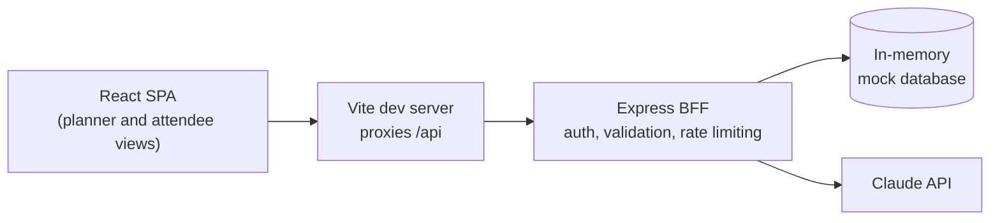

# GatherOS

[](https://github.com/samssj10/GatherOS/actions/workflows/ci.yml)

**A multi-sided corporate offsite platform.** Event planners build and budget an itinerary on a dense desktop dashboard, with AI-generated drafts from Claude. Attendees get a mobile-first view to see the schedule, RSVP in one tap and set dietary preferences. Both personas run from a single React app on top of a Node.js backend-for-frontend (BFF).

<p align="center">
  
  <br>
  <sub><b>Planner dashboard:</b> budget, RSVP totals and the drag-and-drop itinerary board</sub>
</p>

<p align="center">
  
  <br>
  <sub><b>Attendee roster:</b> 2,500 people, searchable and filterable, virtualized</sub>
</p>

<p align="center">
  
  <br>
  <sub><b>Attendee view (mobile):</b> one-tap RSVP and a vertical schedule timeline</sub>
</p>

## Features

### For planners (desktop)

- **AI itinerary drafts.** Describe the offsite in a prompt, optionally set the city, number of days and attendee count, and Claude returns a structured itinerary. The draft appears on the board as *unsaved*, with the budget recalculated, until you save it or discard it.
- **Drag-and-drop calendar.** A three-day board where sessions can be reordered within a day or dropped onto another day, by mouse or keyboard (Space, arrow keys, Space). A marker shows where a card will land. Every card also has up, down, previous-day and next-day buttons as a non-drag alternative.
- **Automatic re-timing.** After any reorder or move, the affected day is re-timed so sessions run back to back, 15 minutes apart, each keeping its own duration. No AI involved, just arithmetic (see below).
- **Budget tracker.** Planned spend against the total budget, with a progress bar that turns amber and then rose as the budget is consumed.
- **Virtualized roster.** All 2,500 attendees are searchable and filterable by RSVP status, yet only about 20 rows exist in the DOM at any time.
- **RSVP overview.** Live accepted, pending and declined totals.

### For attendees (mobile-first)

- **One-tap RSVP** with an optimistic UI: the screen responds instantly and rolls back if the save fails.
- **Vertical timeline** of the schedule, grouped by day, with RSVP-required sessions flagged.
- **Dietary preferences** (none, vegetarian, vegan, gluten-free) saved instantly.
- Generous touch targets (at least 48px) and a sticky bottom navigation bar.

### Platform

- Role-based access: planners and attendees see different routes and different API permissions.
- Accessibility audited with axe-core (0 violations across every screen), skip link, live regions and per-page titles.
- A Playwright end-to-end journey with network interception, run in CI on every push.

## Tech stack

| Layer | Technology |
| --- | --- |
| Client | React 19, Vite, TypeScript (strict), Tailwind CSS v4, React Router, Lucide icons |
| Server state | TanStack Query v5 |
| Client UI state | Zustand (ephemeral UI state only: toasts and roster filters) |
| Performance and interaction | `@tanstack/react-virtual`, `@dnd-kit/core` |
| BFF | Node.js, Express 5, TypeScript, zod, helmet, pino, express-rate-limit |
| AI | Anthropic Claude via the official SDK, using structured JSON output |
| Quality | Playwright, ESLint, Husky and lint-staged, GitHub Actions |

## Architecture



**Server.** Requests flow `route -> controller -> service`. Controllers only translate HTTP; business logic and every external call live in `services/`. All request bodies, query strings and params are validated with zod. A single `AppError` class and a global error handler return consistent JSON errors and never leak stack traces. Logs are structured (pino) with PII fields such as email and name redacted, and token usage is logged for each AI call.

**Client.** There is a strict boundary between two kinds of state. Anything fetched from the BFF lives in TanStack Query and is never copied elsewhere. Zustand holds only UI state that has no server counterpart. Pages and layouts are route-split with `React.lazy`.

### Design decisions worth knowing

- **Optimistic updates with rollback.** RSVP, dietary and drag-and-drop moves update the cache immediately, restore the previous value on error, and confirm with a toast only after the server answers.
- **AI drafts live in a cache-only query.** The unsaved draft is stored under a TanStack Query key with `skipToken`, so it is never refetched. A window refocus cannot overwrite it with the saved itinerary. Moving cards inside a draft is purely local, and nothing reaches the server until the planner clicks *Save*.
- **Model output is not trusted.** Even with structured outputs, Claude's response is re-validated with the same zod schema used by the save endpoint, and its IDs are replaced with unique ones.
- **Re-timing is deterministic and shared.** The rule lives in one small pure function, `reflowDay`, on the server and mirrored on the client. The client copy makes the board update instantly; the server's answer then replaces it, so the two can never silently drift apart.
- **Sessions are signed cookies.** The session is an HMAC-signed token in an `HttpOnly`, `SameSite=Strict` cookie (`Secure` in production), verified with a constant-time comparison.

## Getting started

### Prerequisites

- Node.js 22 or newer and npm
- An [Anthropic API key](https://console.anthropic.com/) (optional, only needed for AI generation)

### Install

```bash
git clone https://github.com/samssj10/GatherOS.git
cd GatherOS

npm install
npm install --prefix client
npm install --prefix server
```

### Configure

```bash
cp server/.env.example server/.env
cp client/.env.example client/.env
```

On Windows PowerShell, use `Copy-Item` instead of `cp`.

Then edit `server/.env`:

1. Set `SESSION_SECRET` to a long random value. You can generate one with:
   ```bash
   node -e "console.log(require('crypto').randomBytes(32).toString('hex'))"
   ```
2. To enable AI generation, set `ANTHROPIC_API_KEY`. Everything else works without it, and the generate endpoint simply answers `503` until a key is set.

### Run

```bash
npm run dev
```

This starts the BFF on <http://localhost:3000> and the client on <http://localhost:5173>. Open the client and sign in with one of the demo accounts.

### Demo accounts

Sign-in is passwordless and uses mock data, so only the email is needed. The login page has shortcut buttons for both.

| Role | Email |
| --- | --- |
| Planner | `planner@gatheros.example.com` |
| Attendee | `amara.silva.0001@example.com` |

Any seeded attendee works. Emails follow the pattern `first.last.NNNN@example.com`, numbered 0001 to 2500.

## Configuration

### Server (`server/.env`)

| Variable | Required | Default | Purpose |
| --- | --- | --- | --- |
| `PORT` | yes | | Port the BFF listens on |
| `SESSION_SECRET` | yes | | HMAC secret for the session cookie (at least 32 characters) |
| `NODE_ENV` | no | `development` | `production` turns on the `Secure` cookie flag |
| `LOG_LEVEL` | no | `info` | pino log level |
| `SESSION_TTL_HOURS` | no | `8` | Session lifetime |
| `PLANNER_EMAIL` | no | `planner@gatheros.example.com` | The email that signs in as the planner |
| `RATE_LIMIT_WINDOW_MS` | no | `60000` | Rate-limit window |
| `RATE_LIMIT_MAX` | no | `300` | General API requests per window |
| `AI_RATE_LIMIT_MAX` | no | `5` | AI generations per window |
| `ANTHROPIC_API_KEY` | no | | Enables AI generation |
| `ANTHROPIC_MODEL` | no | `claude-haiku-4-5` | Model used for itineraries |
| `ANTHROPIC_BASE_URL` | no | | Override the API endpoint (proxies, test doubles) |

### Client (`client/.env`)

| Variable | Default | Purpose |
| --- | --- | --- |
| `VITE_API_PROXY_TARGET` | `http://localhost:3000` | Where the Vite dev server proxies `/api` |
| `VITE_API_URL` | `/api` | Base path the client uses for BFF calls |

Secrets are never committed: both `.env` files are gitignored, and only the `.env.example` templates are tracked.

## Scripts

Run from the repository root.

| Command | What it does |
| --- | --- |
| `npm run dev` | Start the BFF and the client together |
| `npm run build` | Build the client and the server |
| `npm run lint` | ESLint for the client and the server |
| `npm run typecheck` | `tsc --noEmit` for the client, server and e2e suite |
| `npm run test:e2e` | Run the Playwright end-to-end suite |

A Husky pre-commit hook runs ESLint and `tsc --noEmit` on staged files through lint-staged.

## API reference

All routes are under `/api`. Errors share one shape: `{ "error": { "code", "message", "details?" } }`.

| Method and path | Access | Description |
| --- | --- | --- |
| `GET /health` | public | Liveness check |
| `POST /auth/login` | public | Body `{ email }`. Sets the session cookie and returns the session |
| `GET /auth/me` | signed in | Current session |
| `POST /auth/logout` | public | Clears the session cookie |
| `GET /attendees` | planner | Paginated roster. Query: `page`, `limit` (max 2500), `search`, `rsvpStatus`, `department` |
| `GET /attendees/summary` | planner | RSVP, dietary and flight totals |
| `GET /attendees/:id` | self or planner | One attendee |
| `PATCH /attendees/:id` | self or planner | Update `rsvpStatus` and/or `dietaryPreference` |
| `GET /schedule` | planner | Full itinerary |
| `GET /schedule/me` | signed in | Attendee-shaped itinerary (`AttendeeScheduleDTO[]`) |
| `GET /schedule/budget` | planner | Budget, estimated spend and remaining |
| `PUT /schedule` | planner | Replace the itinerary (used to save an AI draft) |
| `PUT /schedule/days/:day/order` | planner | Body `{ itemIds }`: every session that should be on that day, in order (may include one moved in from another day). The server re-times the day and returns the full itinerary |
| `POST /ai/generate-schedule` | planner | Generate an itinerary with Claude. Rate limited |

## Testing and CI

The end-to-end journey in [`e2e/offsite-flow.spec.ts`](e2e/offsite-flow.spec.ts) covers the whole product in one run:

1. Inject a signed planner cookie to bypass the login screen.
2. Intercept `POST /api/ai/generate-schedule` with `page.route()` and return a hardcoded valid response.
3. Assert the three-column board renders the mocked sessions in the right days.
4. Clear cookies, inject an attendee cookie and reload.
5. Delay the RSVP request by 500 ms, click *Accept RSVP*, assert the UI updates before the response arrives, then assert the success toast.

The suite starts its own BFF and client on separate ports (3100 and 5273), so it never collides with `npm run dev`. It needs no `.env` file and no API key, because the AI call is mocked and the AI key is blanked on purpose.

```bash
npx playwright install chromium   # first run only
npm run test:e2e
```

GitHub Actions ([`ci.yml`](.github/workflows/ci.yml)) runs on every push and pull request with two jobs: **Typecheck and lint** (`tsc --noEmit` and ESLint) and **Playwright** (the journey above, with the HTML report uploaded as an artifact).

## Project structure

```
GatherOS/
├── .github/workflows/ci.yml     # Typecheck, lint and Playwright
├── .husky/                      # Pre-commit hook (lint-staged)
├── client/                      # React SPA
│   └── src/
│       ├── api/                 # TanStack Query hooks and the BFF fetch client
│       ├── components/          # UI widgets (layout, planner, attendee)
│       ├── context/             # Auth context
│       ├── hooks/               # Custom hooks
│       ├── store/               # Zustand store (UI state only)
│       ├── types/               # Shared domain models
│       └── views/               # Route-level pages (lazy-loaded)
├── server/                      # Express BFF
│   └── src/
│       ├── controllers/         # HTTP request and response mapping
│       ├── middlewares/         # Auth, validation, rate limiting, error handling
│       ├── routes/              # Router definitions
│       ├── services/            # Business logic, mock database, Claude calls
│       └── utils/               # AppError, logger, env parsing, schemas
├── e2e/                         # Playwright suite and helpers
├── docs/screenshots/            # Images used in this README
└── package.json                 # Root scripts
```

## Known limitations

- **No persistent database.** Data lives in server memory and resets on every restart: the 2,500 attendees, the itinerary and any saved changes.
- **Mock authentication.** Sign-in is passwordless and exists for demonstration. Replace it with a real identity provider before any real use.
- **Reordering collapses gaps.** Re-timing packs a day back to back with 15-minute gaps, so any longer gaps (a lunch break, free time) are closed up when you reorder that day. The day starts at the same time it did before. A move to another day re-times only the destination day, and the day it left is left as it was. A reorder that would push a day past midnight is refused.
- **Single event, three days.** The data model and UI are built around one offsite of up to three days.
- **No unit tests yet.** Coverage today is the end-to-end journey plus static checks (types and lint).
